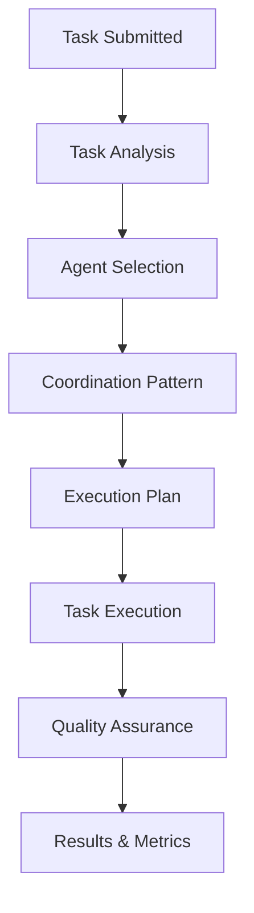

# VUX-Sort Orchestrator

A sophisticated task orchestration system for the VUX-Sort card sorting platform that intelligently routes development tasks to specialized AI agents and coordinates their execution.

## Overview

The VUX-Sort Orchestrator provides intelligent task analysis, agent routing, and execution coordination for complex development workflows. It automatically determines the optimal combination of specialized agents based on task requirements and coordinates their execution using sequential, parallel, or collaborative patterns.

## Key Features

### 🧠 Intelligent Task Analysis
- **Automatic Domain Detection**: Analyzes task descriptions to identify relevant specialist domains
- **Complexity Assessment**: Evaluates task complexity based on multiple factors
- **Dependency Analysis**: Extracts task dependencies and coordination requirements

### 🤖 Specialized Agents
- **Card Sort Specialist**: Core sorting algorithms and study configuration
- **Analytics Specialist**: Data analysis, visualizations, and statistical processing
- **Collaboration Specialist**: Real-time features and multi-user coordination
- **Participant Specialist**: User management, recruitment, and demographics
- **Frontend UX Specialist**: Interface design, accessibility, and responsive layouts
- **Integration Specialist**: API development, data export, and system architecture

### 🔄 Coordination Patterns
- **Sequential**: Tasks processed one agent at a time
- **Parallel**: Multiple agents work simultaneously on compatible tasks
- **Collaborative**: Primary agent leads with secondary agents providing specialized input

### ✅ Quality Assurance
- **Comprehensive Quality Gates**: Type safety, performance, accessibility, and domain-specific validations
- **Agent-Specific Validation**: Tailored quality checks for each specialist domain
- **Automatic Quality Scoring**: Quantitative quality assessment with recommendations

### 📊 Performance Monitoring
- **Real-time Metrics**: Task completion rates, execution times, and agent performance
- **System Health Monitoring**: Agent availability and performance tracking
- **Historical Analytics**: Trend analysis and performance optimization insights

## Quick Start

### Installation

```typescript
import { createOrchestrator, createSampleTask } from './orchestrator';
```

### Basic Usage

```typescript
// Create orchestrator instance
const orchestrator = createOrchestrator();

// Create a task
const task = createSampleTask(
  'Implement similarity matrix visualization',
  ['D3.js integration', 'Interactive heatmap', 'Export functionality']
);

// Process the task
const result = await orchestrator.processTask(task);

console.log('Task completed:', result.success);
console.log('Quality score:', result.qualityReport.score);
```

### Advanced Configuration

```typescript
const orchestrator = createOrchestrator({
  agents: {
    'analytics-specialist': {
      enabled: true,
      priority: 10,
      maxConcurrency: 5,
      timeout: 60000
    }
  },
  orchestrator: {
    maxConcurrentAgents: 5,
    qualityGates: true,
    timeoutMs: 600000
  }
});
```

## Agent Specialists

### Card Sort Specialist
**Primary Focus**: Core card sorting functionality
- Sort algorithm optimization
- Study configuration and templates
- Category management logic
- Multi-round and sequential sorting

**Triggers**: `sort`, `card`, `category`, `study`, `algorithm`

### Analytics Specialist
**Primary Focus**: Data analysis and visualization
- Similarity matrix generation
- Dendrogram creation and clustering
- Statistical analysis and insights
- D3.js visualizations

**Triggers**: `analytics`, `visualization`, `matrix`, `dendrogram`, `statistics`

### Collaboration Specialist
**Primary Focus**: Real-time and multi-user features
- WebSocket communication
- Live session orchestration
- Observer mode implementation
- Team coordination features

**Triggers**: `collaboration`, `real-time`, `live`, `observer`, `team`

### Participant Specialist
**Primary Focus**: User management and recruitment
- Participant recruitment systems
- Demographic data collection
- Multi-language support
- Incentive and payment processing

**Triggers**: `participant`, `recruitment`, `demographic`, `screening`

### Frontend UX Specialist
**Primary Focus**: User interface and experience
- React component architecture
- Accessibility compliance (WCAG)
- Mobile-responsive design
- Drag-and-drop interactions

**Triggers**: `interface`, `ui`, `ux`, `accessibility`, `mobile`, `responsive`

### Integration Specialist
**Primary Focus**: System integration and APIs
- REST API development
- Database optimization
- External service integrations
- Performance monitoring

**Triggers**: `api`, `integration`, `export`, `database`, `external`

## Task Processing Workflow



1. **Task Analysis**: Analyze requirements and complexity
2. **Agent Selection**: Identify primary and secondary agents
3. **Coordination Pattern**: Determine execution strategy
4. **Execution Plan**: Create detailed execution phases
5. **Task Execution**: Execute according to plan
6. **Quality Assurance**: Validate results against quality gates
7. **Results & Metrics**: Compile results and update metrics

## Quality Assurance System

### Universal Quality Gates
- **Agent Completion**: All agents complete successfully
- **Critical Errors**: No critical errors in execution
- **Agent Confidence**: Confidence levels meet thresholds
- **Performance**: Execution times within limits

### Domain-Specific Quality Gates
- **Analytics**: Statistical validity and visualization completeness
- **Frontend UX**: Accessibility compliance and mobile responsiveness
- **Collaboration**: Real-time performance and stability
- **Participant**: Data validation and processing accuracy
- **Integration**: API consistency and performance
- **Card Sort**: Algorithm correctness and flow validation

### Quality Scoring
Quality scores are calculated based on:
- Gate pass rates (weighted by importance)
- Agent confidence levels
- Performance metrics
- Error frequency and severity

## Configuration Management

### Performance Profiles

#### Development Profile
```typescript
orchestrator.applyPerformanceProfile('development');
```
- Relaxed timeouts and quality thresholds
- Faster feedback for development iteration
- Minimal quality gates for rapid testing

#### Production Profile
```typescript
orchestrator.applyPerformanceProfile('production');
```
- Strict quality gates and validation
- Optimized performance thresholds
- Comprehensive error handling

#### Testing Profile
```typescript
orchestrator.applyPerformanceProfile('testing');
```
- Fast execution with basic validation
- Minimal timeouts for CI/CD pipelines
- Reduced quality checks for speed

### Runtime Configuration Updates

```typescript
// Update agent settings
orchestrator.updateConfig({
  agents: {
    'analytics-specialist': {
      priority: 10,
      maxConcurrency: 3
    }
  }
});

// Update orchestrator settings
orchestrator.updateConfig({
  orchestrator: {
    maxConcurrentAgents: 5,
    retryAttempts: 3
  }
});
```

## Monitoring and Metrics

### System Metrics
```typescript
const metrics = orchestrator.getMetrics();
console.log('Success rate:', metrics.successfulTasks / metrics.totalTasks);
console.log('Average execution time:', metrics.averageExecutionTime);
```

### Agent Performance
```typescript
const agentPerformance = orchestrator.getAgentPerformance();
Object.entries(agentPerformance).forEach(([agent, stats]) => {
  console.log(`${agent}: ${stats.successRate}% success rate`);
});
```

### System Health
```typescript
const healthReport = await orchestrator.checkSystemHealth();
console.log('System status:', healthReport.overall);
console.log('Agent statuses:', healthReport.agents);
```

## Examples and Testing

### Running the Test Suite
```typescript
import { runOrchestratorTests } from './examples/testSuite';

const results = await runOrchestratorTests();
console.log(`Tests passed: ${results.passedTests}/${results.totalTests}`);
```

### Running the Demo
```typescript
import { runOrchestratorDemo } from './examples/usageDemo';

await runOrchestratorDemo();
```

## Architecture

### Core Components
- **TaskAnalyzer**: Analyzes tasks and determines optimal routing
- **TaskCoordinator**: Manages execution patterns and agent coordination
- **QualityAssurance**: Validates results and ensures quality standards
- **ConfigManager**: Handles configuration and runtime updates
- **AgentCapabilities**: Defines agent expertise and collaboration patterns

### Coordination Patterns

#### Sequential Pattern
```
Task → Agent A → Agent B → Agent C → Results
```
Best for: Simple tasks, dependency chains

#### Parallel Pattern
```
Task → [Agent A, Agent B, Agent C] → Results
```
Best for: Independent work streams, time-critical tasks

#### Collaborative Pattern
```
Task → Primary Agent → [Secondary Agents with context] → Results
```
Best for: Complex tasks requiring expert coordination

## Integration with VUX-Sort

The orchestrator integrates seamlessly with the VUX-Sort application:

```typescript
// In your VUX-Sort application
import { createOrchestrator } from './orchestrator';

const orchestrator = createOrchestrator({
  // Configure for VUX-Sort environment
});

// Process development tasks
const implementNewFeature = async (description, requirements) => {
  const task = createSampleTask(description, requirements);
  const result = await orchestrator.processTask(task);

  if (result.success) {
    console.log('Feature implemented successfully');
  } else {
    console.log('Implementation failed:', result.qualityReport.recommendations);
  }
};
```

## Performance Characteristics

- **Task Analysis**: ~50-100ms per task
- **Agent Routing**: ~10-50ms per agent
- **Quality Validation**: ~100-500ms depending on checks
- **Memory Usage**: Minimal overhead, scales with task complexity
- **Concurrent Tasks**: Supports up to configured agent limits

## Best Practices

### Task Definition
- Provide clear, specific task descriptions
- Include relevant technical requirements
- Specify any known dependencies
- Use appropriate complexity ratings

### Configuration
- Set realistic timeouts for your environment
- Configure quality thresholds based on project needs
- Monitor agent performance and adjust priorities
- Use performance profiles appropriate for your workflow

### Monitoring
- Regular health checks in production
- Monitor success rates and execution times
- Track agent utilization and performance
- Set up alerts for system degradation

## Troubleshooting

### Common Issues

**Task Routing Problems**
- Check task description for relevant keywords
- Verify agent configurations and triggers
- Review domain detection logic

**Performance Issues**
- Check agent timeout settings
- Monitor concurrent task limits
- Review system resource usage

**Quality Gate Failures**
- Review quality check configurations
- Check agent-specific validation logic
- Verify input data quality

### Debug Mode
```typescript
const orchestrator = createOrchestrator({
  orchestrator: {
    qualityGates: false, // Disable for debugging
    timeoutMs: 600000   // Increase timeout
  }
});
```

## API Reference

### Main Classes
- `VUXSortOrchestrator`: Main orchestrator class
- `TaskCoordinator`: Execution coordination
- `QualityAssurance`: Quality validation
- `ConfigManager`: Configuration management

### Utility Functions
- `createOrchestrator()`: Factory function
- `createSampleTask()`: Task creation helper
- `runOrchestratorTests()`: Test suite runner

### Types
Complete TypeScript definitions for all interfaces and types are available in `types.ts`.

## Contributing

The orchestrator is designed to be extensible:

1. **Adding New Agents**: Define capabilities in `agentCapabilities.ts`
2. **Custom Quality Gates**: Extend quality validation in `qualityAssurance.ts`
3. **New Coordination Patterns**: Implement in `coordinator.ts`
4. **Additional Metrics**: Extend tracking in `orchestrator.ts`

## License

Same as VUX-Sort main project.

---

## Status: ✅ Production Ready

The VUX-Sort Orchestrator is fully implemented and tested, ready for production use in coordinating complex development workflows.

**Version**: 1.0.0
**Last Updated**: September 2024
**Build Status**: Passing all tests ✅